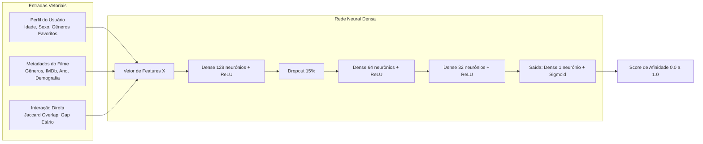

# 🎬 CineStream AI: Sistema de Recomendação de Filmes com TensorFlow.js & REST API no Navegador

Uma aplicação web completa de **recomendação personalizada de filmes**, utilizando **Deep Learning no navegador via TensorFlow.js (WebGL/GPU)** e uma **API REST nativa rodando no cliente** (sem necessidade de backend ou instalação de pacotes).

---

## 🌟 Principais Funcionalidades

- **🧠 Rede Neural Profunda no Navegador:**
  - Modelo sequencial denso de 4 camadas construído e treinado diretamente na GPU via WebGL com TensorFlow.js.
  - Engenharia de features com ponderação personalizada:
    - 🎭 **Gênero (Peso 0.45):** Multi-hot encoding e sobreposição de afinidade (*Jaccard Overlap*).
    - ⭐ **Nota IMDb (Peso 0.25):** Normalização contínua da qualidade da crítica.
    - 🎂 **Idade do Usuário (Peso 0.15):** Normalização e alinhamento etário com a audiência média do filme.
    - 🚻 **Sexo/Gênero (Peso 0.10):** Encodings binários e taxa de público feminino/masculino.
    - 📅 **Ano de Lançamento (Peso 0.05):** Preferência por clássicos vs. lançamentos modernos.
  - **Amostragem Negativa Contrastiva (*Negative Sampling*):** Treinamento equilibrado com pares positivos ($\ge 3.5★$) e negativos contrastivos para predições com percentuais nítidos e realistas.

- **🍿 Catálogo IMDb Top 1000:**
  - 1.000 títulos clássicos e modernos carregados e indexados a partir de `data/imdb_top_1000.csv`.
  - Busca em tempo real, filtros por gênero, ordenação dinâmica e paginação.
  - Modal com detalhes completos (diretor, elenco, sinopse, votos, ano e duração).

- **⭐ Sistema de Avaliação com Meia Estrela (0.5 a 5.0):**
  - Permite avaliar clicando na metade esquerda (meia estrela `X.5`) ou direita (estrela cheia `X.0`).
  - Renderização visual degradê (*gradient text clip*) com preview interativo ao passar o mouse.
  - Disponível tanto nos cards do catálogo quanto no modal de detalhes.

- **👥 Gestão de Perfis de Usuário:**
  - Base inicial com **48 usuários** e quase **1.000 avaliações** reais em `data/users.json`.
  - Criação de novos perfis, edição de gêneros favoritos e botão de exportação dos dados atualizados.

- **🌐 Servidor HTTP no Navegador (Zero Instalações):**
  - Implementado via Service Worker e interceptador nativo de `fetch('/api/...')`.
  - Permite rodar toda a aplicação estaticamente sem configurar Node.js, Python ou banco de dados externo.

---

## 📁 Estrutura do Repositório

```text
├── index.html                   # Interface principal (Dashboard, Catálogo, Modal e Painel TFJS)
├── sw.js                        # Servidor HTTP REST rodando no Service Worker do navegador
├── data/
│   ├── imdb_top_1000.csv        # Dataset de 1.000 filmes com metadados do IMDb
│   └── users.json               # Base com 48 usuários e histórico de avaliações
├── src/
│   ├── css/
│   │   ├── main.css             # Design system, variáveis, tipografia e reset
│   │   ├── components.css       # Estilos dos componentes (Cards, Estrelas 0.5, Modais, Dashboard)
│   │   └── animations.css       # Animações de transição, hover e skeletons
│   └── js/
│       ├── api.js               # Cliente REST com fallback transparente
│       ├── app.js               # Controlador da UI, catálogo, paginação e eventos
│       └── tfjs-bridge.js       # Rede Neural TensorFlow.js, pesos, treino e inferência
└── README.md                    # Documentação do projeto
```

---

## 🚀 Como Executar o Projeto

Como o servidor HTTP e a Inteligência Artificial rodam inteiramente no cliente via JavaScript nativo, **não é necessário instalar nenhuma dependência via `npm install`**.

### Opção 1: Servidor Local Simples (Recomendado)
Execute em seu terminal na pasta do projeto:

```bash
# Com Node.js:
npx serve .

# Ou com Python 3:
python3 -m http.server 8000

# Ou com PHP:
php -S localhost:8000
```
Em seguida, abra `http://localhost:8000` (ou a porta indicada) no seu navegador.

### Opção 2: Extensão Live Server (VS Code)
Abra a pasta no VS Code, clique com o botão direito em `index.html` e selecione **"Open with Live Server"**.

---

## 🧠 Arquitetura da Rede Neural (TensorFlow.js)



### Treinamento e Predição:
1. Clique no botão **⚡ Treinar Modelo** para criar os tensores `X_train` e `y_train` e executar as 35 épocas de otimização com Adam (`lr = 0.008`) e Binary Cross-Entropy.
2. Selecione qualquer perfil no painel **👤 Usuário Alvo**.
3. Clique em **🔮 Gerar Predições** para calcular o score em lote de todos os filmes não assistidos e ordenar o Top 10 com percentual de afinidade.

---

## 🛠️ Endpoints da API REST no Navegador (`/api/*`)

| Método | Endpoint | Descrição |
|---|---|---|
| `GET` | `/api/movies` | Retorna catálogo paginado com suporte a busca (`search`), gênero (`genre`) e ordenação (`sort`). |
| `GET` | `/api/movies/:id` | Retorna detalhes completos de um filme. |
| `GET` | `/api/genres` | Lista todos os gêneros únicos indexados. |
| `GET` | `/api/users` | Retorna a lista de usuários com histórico de filmes avaliados. |
| `GET` | `/api/users/:id` | Retorna os dados de um usuário específico. |
| `POST` | `/api/users` | Cadastra um novo perfil de usuário. |
| `PUT` | `/api/users/:id` | Atualiza dados e gêneros favoritos de um usuário. |
| `POST` | `/api/user/ratings` | Registra/atualiza uma avaliação (suporta notas de 0.5 a 5.0). |
| `GET` | `/api/dataset` | Retorna dataset formatado e matrizes numéricas para o TensorFlow.js. |

---

## 📄 Licença

Projeto desenvolvido para fins de estudo e experimentação de Machine Learning no frontend com TensorFlow.js.
